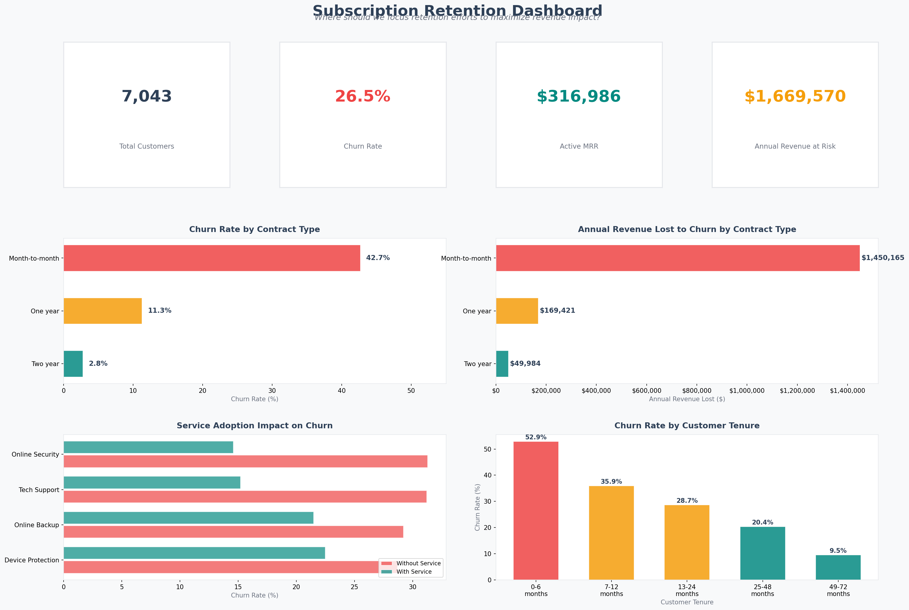
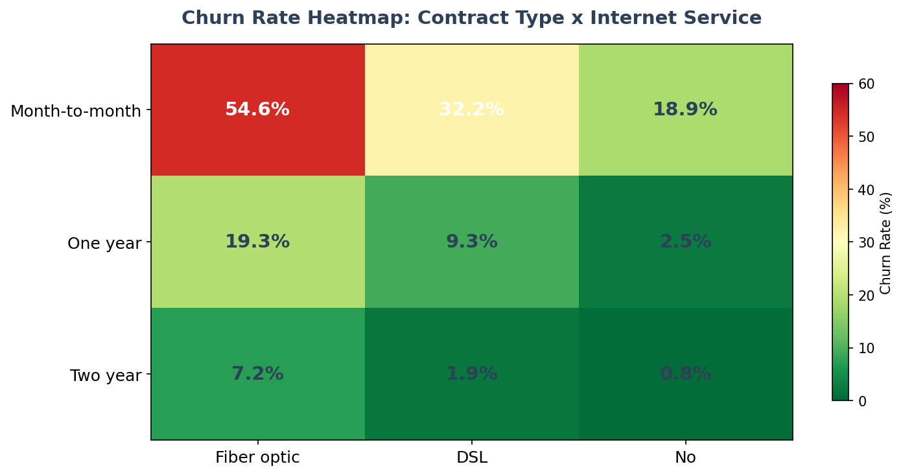
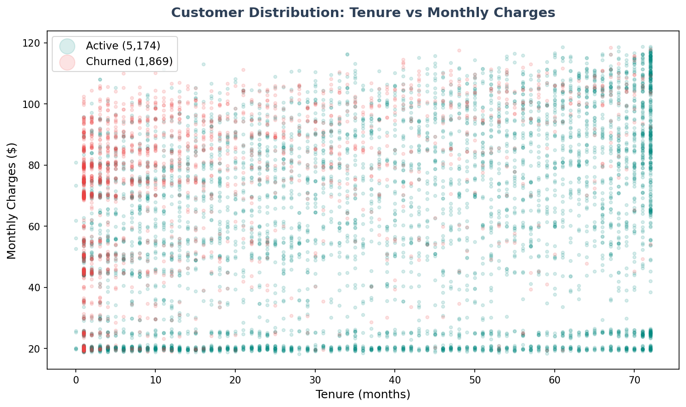
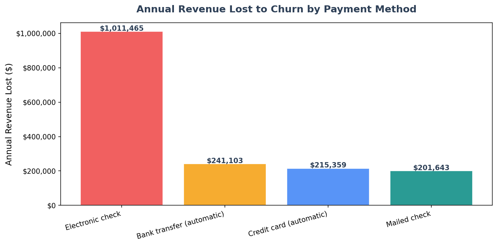

# Retention Dashboard - Subscription Service Analytics

A data-driven dashboard answering the question: Where should we focus retention efforts to maximize revenue impact? Built with Python using 7,043 real customer records.

## The Business Question

Every subscription business needs to decide where to invest its retention efforts. This dashboard identifies the highest-impact levers by combining churn analysis, revenue impact, service adoption, and customer segmentation into a single actionable view.

## Dashboard

## Key Findings

### Highest-Risk Segment
Month-to-month customers on fiber optic internet represent the highest churn risk, combining the most expensive plans with the lowest retention. This single segment drives the majority of revenue lost to churn.

### Churn Risk Heatmap

### Customer Distribution
Active customers cluster at higher tenure and spread across price points. Churned customers concentrate at low tenure and high monthly charges, confirming a price sensitivity pattern among newer customers.

### Revenue at Risk by Payment Method

## Action Items (Priority Order)

1. **Convert month-to-month to annual contracts** - Largest churn gap (42.7% vs 2.8%), largest revenue impact
2. **Bundle Online Security and Tech Support** - 15-17 percentage point churn reduction when adopted
3. **Invest in first-6-month onboarding** - 52.9% of new customers churn in this window
4. **Migrate electronic check users to auto-pay** - Highest churn rate among payment methods
5. **Review fiber optic pricing** - Premium customers churning at premium rates

## Dataset

[IBM Telco Customer Churn Dataset](https://github.com/IBM/telco-customer-churn-on-icp4d/blob/master/data/Telco-Customer-Churn.csv) (7,043 customers, via Kaggle public domain)

## Tech Stack

- Python (Pandas, NumPy, Matplotlib)
- Real-world dataset (7,043 customer records)

## How to Run

    pip3 install pandas matplotlib numpy
    python3 dashboard.py

Charts are saved to the /charts directory.

## Connection to Other Projects

This dashboard is part of a portfolio analyzing the same dataset from multiple angles:
- [dbt + Snowflake project](https://github.com/SavitaOkhuysen/saas-subscription-analytics) - Data infrastructure and modeling
- [Product analytics](https://github.com/SavitaOkhuysen/saas-product-analytics) - Churn drivers and recommendations
- [A/B test analysis](https://github.com/SavitaOkhuysen/ab-test-analysis) - Experiment evaluation framework
